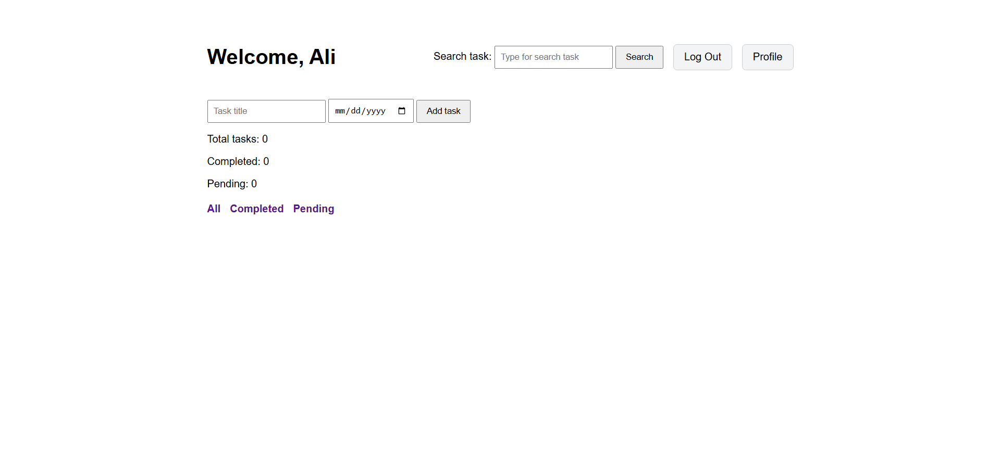

#  Django Todo App

A simple Todo List web application built with Django.

##  Screenshot

##  Live Demo

🔗 https://todolist-app-s7f6.onrender.com

> **Note:** The free Render plan may take 30–60 seconds to wake up after inactivity.

##  Features

- User Registration
- User Login & Logout
- Profile Management
  - Change Username
  - Change Email
  - Change Password
- Create Tasks
- Edit Tasks
- Delete Tasks
- Mark Tasks as Completed
- Search Tasks
- Filter Tasks (All / Completed / Pending)
- Optional Deadline for Tasks
- Success & Error Messages
- Authentication Required

##  Tech Stack

- Python
- Django
- HTML
- CSS
- SQLite (Development)
- PostgreSQL (Production)
- Gunicorn
- WhiteNoise
- Render
